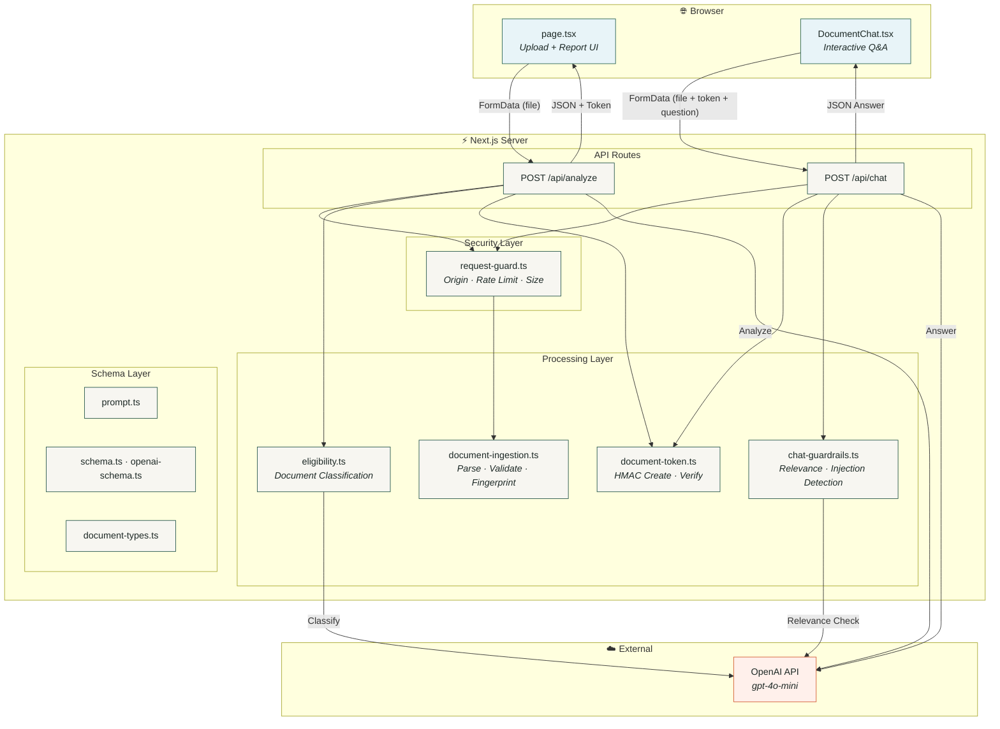
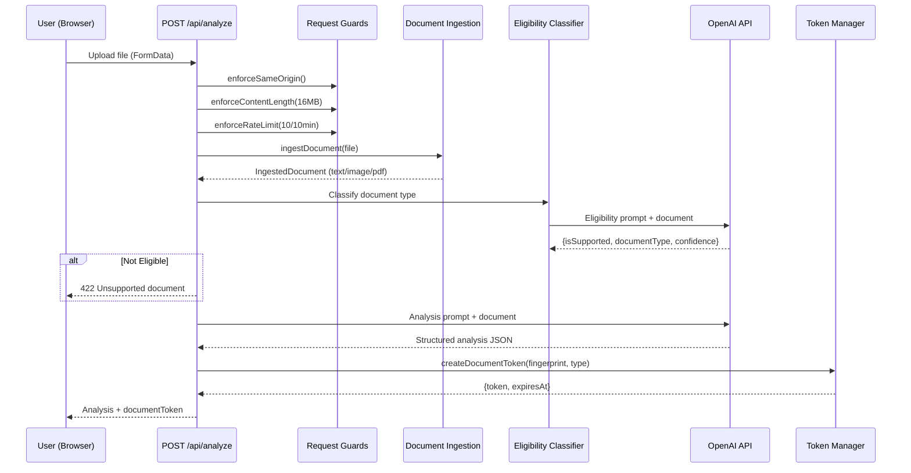
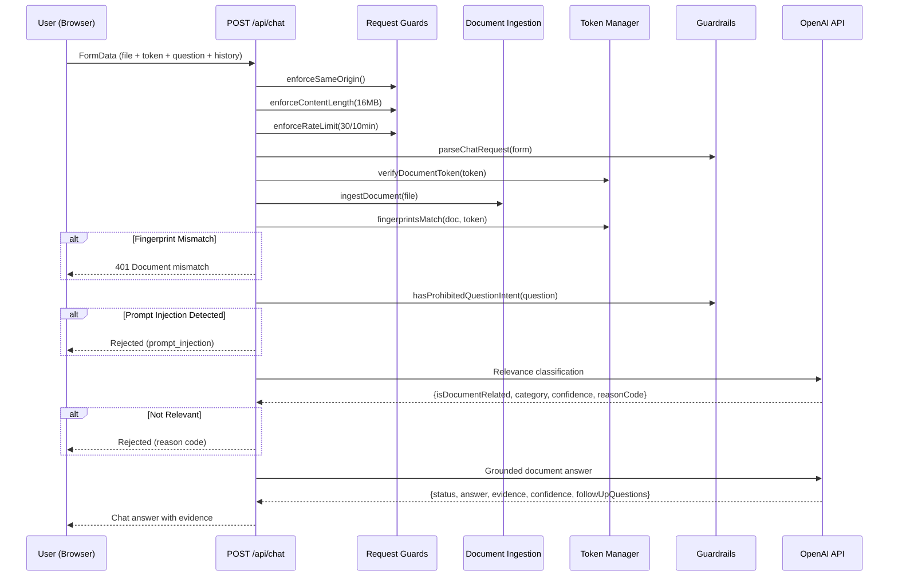
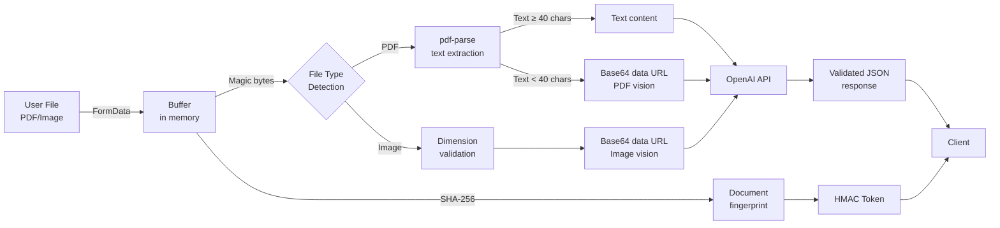
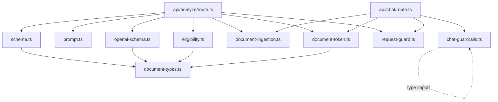

# Architecture

> System architecture, component design, and data flow documentation for Clarity.

---

## Table of Contents

- [Overview](#overview)
- [Architecture Style](#architecture-style)
- [System Architecture Diagram](#system-architecture-diagram)
- [Request Lifecycle](#request-lifecycle)
- [Component Map](#component-map)
- [Frontend Architecture](#frontend-architecture)
- [Backend Architecture](#backend-architecture)
- [AI Processing Pipeline](#ai-processing-pipeline)
- [Security Architecture](#security-architecture)
- [Data Flow](#data-flow)
- [Module Dependency Graph](#module-dependency-graph)
- [Design Decisions](#design-decisions)

---

## Overview

Clarity is a **serverless monolith** — a single Next.js 14 application that combines a React frontend with Node.js API routes. It follows the Next.js App Router convention where:

- **Pages** (`app/page.tsx`) serve the client UI
- **API Routes** (`app/api/*/route.ts`) serve as the backend
- **Library modules** (`lib/*`) contain shared server-side logic

There is no separate backend, no database, no message queue, and no external storage. All processing is ephemeral and completes within a single HTTP request/response cycle.

---

## Architecture Style

| Attribute | Value |
|---|---|
| **Pattern** | Serverless Monolith (Frontend + API in one deployment) |
| **API Style** | REST-like (POST with multipart/form-data) |
| **State Management** | Stateless server; React state on client |
| **AI Integration** | Synchronous OpenAI API calls with structured JSON output |
| **Session Model** | Stateless HMAC-signed document tokens (no server-side sessions) |
| **Deployment Model** | Single-unit deployment (Vercel, Node.js, Docker) |

---

## System Architecture Diagram



---

## Request Lifecycle

### Document Analysis Flow



### Document Chat Flow



---

## Component Map

### Frontend Components

| Component | File | Responsibility |
|---|---|---|
| `RootLayout` | `app/layout.tsx` | HTML shell, metadata, global CSS imports |
| `Home` | `app/page.tsx` | Upload UI, analysis report rendering, conditional chat display |
| `Section` | `app/page.tsx` | Reusable report section container |
| `ItemList` | `app/page.tsx` | Renderer for finding items (key points, pros, cons) |
| `DocumentChat` | `components/DocumentChat.tsx` | Full interactive chat component with message history, suggestions, and compose form |

### Backend Modules

| Module | File | Responsibility |
|---|---|---|
| Analyze Route | `app/api/analyze/route.ts` | Document analysis orchestration |
| Chat Route | `app/api/chat/route.ts` | Document Q&A orchestration |
| Document Ingestion | `lib/document-ingestion.ts` | File validation, PDF parsing, image dimension checks, fingerprinting |
| Document Token | `lib/document-token.ts` | HMAC token creation, verification, expiry enforcement |
| Chat Guardrails | `lib/chat-guardrails.ts` | Request parsing, relevance schemas, prohibited intent detection |
| Eligibility | `lib/eligibility.ts` | Document type classification logic and prompts |
| Request Guard | `lib/request-guard.ts` | Same-origin, content-length, and rate limit enforcement |
| Prompt | `lib/prompt.ts` | System prompt for document analysis |
| Schema | `lib/schema.ts` | Zod validation schemas for analysis response |
| OpenAI Schema | `lib/openai-schema.ts` | JSON Schema for OpenAI structured output |
| Document Types | `lib/document-types.ts` | Supported document type constants |

---

## Frontend Architecture

The frontend is a single-page React application using Next.js App Router:

```
app/
├── layout.tsx         ← Root <html> + metadata
├── page.tsx           ← Main UI (client component)
├── globals.css        ← Design system + layout styles
└── chat.css           ← Document chat styles
```

**State Management:** All state is managed via React `useState` hooks within `Home` and `DocumentChat` components. There is no global state management library.

**Styling:** Custom vanilla CSS with a design system based on:
- **Typography:** DM Sans (body), DM Mono (labels), Playfair Display (headings)
- **Colors:** Muted greens (`#20584b`, `#28584c`), warm accents (`#d45e35`, `#e47242`)
- **Layout:** CSS Grid for report sections, responsive breakpoints at 680px

---

## Backend Architecture

### API Route Pattern

Both API routes follow a consistent pattern:

1. **Security checks** — Same-origin, content-length, rate limit
2. **Input parsing** — FormData extraction and validation
3. **Document ingestion** — File type verification, parsing, fingerprinting
4. **AI processing** — One or more OpenAI API calls with structured output
5. **Response** — Validated JSON response
6. **Error handling** — Typed catch blocks with appropriate HTTP status codes

### Runtime Configuration

```typescript
export const runtime = "nodejs";    // Requires Node.js (not Edge)
export const dynamic = "force-dynamic"; // Disable route caching
```

---

## AI Processing Pipeline

Clarity makes **multiple sequential AI calls** per operation:

### Analysis Pipeline (2 calls)

```
1. Eligibility Classification  →  Is this a legal/policy document?
2. Document Analysis           →  Full structured analysis with risk scoring
```

### Chat Pipeline (2 calls)

```
1. Relevance Classification    →  Is this question about the document?
2. Grounded Answer Generation  →  Answer from document with evidence
```

All AI calls use:
- **Structured Output** via `response_format: { type: "json_schema" }` with strict schemas
- **Low Temperature** (0 for classification, 0.1 for generation) for deterministic output
- **Zod Validation** on all AI responses before returning to client
- **Confidence Normalization** to handle 0–1 vs 0–100 float inconsistencies

---

## Security Architecture

```mermaid
graph LR
    subgraph ClientSide["Client-Side"]
        FileValidation["File Type + Size<br/>Validation"]
        AbortCtrl["Request Timeout<br/>(90s AbortController)"]
        TokenExpiry["Token Expiry<br/>Check"]
    end

    subgraph ServerSide["Server-Side"]
        Origin["Same-Origin<br/>Enforcement"]
        ContentLen["Content-Length<br/>Guard (16MB)"]
        RateLimit["Rate Limiter<br/>(IP-scoped)"]
        MagicByte["Magic-Byte<br/>File Verification"]
        ImgDims["Image Dimension<br/>Validation"]
        TokenVerify["HMAC Token<br/>Verification"]
        FPMatch["Fingerprint<br/>Matching"]
        PromptInject["Prompt Injection<br/>Regex Detection"]
    end

    subgraph AILevel["AI-Level"]
        RelevanceGate["Relevance<br/>Classification"]
        GroundedPrompt["Grounded-Only<br/>System Prompt"]
        UntrustedTags["Untrusted Data<br/>Tagging"]
    end

    ClientSide --> ServerSide --> AILevel
```



---

## Data Flow

### Document Data Through the System



---

## Module Dependency Graph



---

## Design Decisions

| Decision | Rationale |
|---|---|
| **No database** | Stateless design reduces operational complexity; all state is ephemeral or encoded in tokens |
| **HMAC tokens over JWTs** | Simpler, no header/library dependencies, adequate for short-lived document sessions |
| **Multiple AI calls per request** | Defense-in-depth: separate classification prevents wasted analysis on ineligible documents |
| **Strict JSON Schema output** | Eliminates need for output parsing heuristics; guarantees type-safe responses |
| **Zod for dual validation** | Validates both runtime data (requests) and AI output (responses) with a single library |
| **No Edge runtime** | PDF parsing (`pdf-parse`) requires Node.js APIs (`Buffer`, `crypto`) not available in Edge |
| **Vanilla CSS over Tailwind** | Full design control with a bespoke visual identity; minimal bundle size |
| **File re-upload for chat** | Avoids server-side file storage; document is re-processed per chat request for security |

---

**Next:** [API.md](API.md) — Complete API endpoint reference with request/response schemas.
