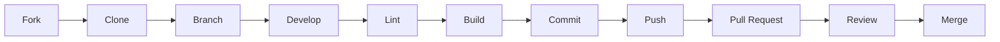

# Contributing

> Contribution guidelines, code standards, and development workflow for Clarity.

---

## Table of Contents

- [Getting Started](#getting-started)
- [Development Workflow](#development-workflow)
- [Code Standards](#code-standards)
- [Project Structure Conventions](#project-structure-conventions)
- [Commit Conventions](#commit-conventions)
- [Pull Request Process](#pull-request-process)
- [Style Guide](#style-guide)
- [Adding New Features](#adding-new-features)
- [Security Contributions](#security-contributions)
- [Documentation](#documentation)

---

## Getting Started

1. **Fork** the repository.
2. **Clone** your fork:
   ```bash
   git clone https://github.com/<your-username>/contract_simplifier.git
   cd contract_simplifier
   ```
3. **Install dependencies:**
   ```bash
   npm install
   ```
4. **Configure environment:**
   ```bash
   cp .env.example .env
   # Add your OPENAI_API_KEY
   ```
5. **Start developing:**
   ```bash
   npm run dev
   ```

---

## Development Workflow



### Branch Naming

```
feature/description    — New features
fix/description        — Bug fixes
docs/description       — Documentation changes
refactor/description   — Code refactoring
security/description   — Security improvements
```

### Development Commands

```bash
npm run dev    # Start development server
npm run lint   # Run ESLint
npm run build  # Production build (includes type checking)
```

---

## Code Standards

### TypeScript

- **Strict mode** is enforced (`tsconfig.json: "strict": true`).
- Use **explicit types** for function parameters and return values in library modules.
- Use **Zod schemas** for runtime validation of external data (API inputs, AI outputs).
- Prefer **discriminated unions** for type-safe branching (see `IngestedDocument`).
- Use **`const assertions`** for immutable constants (see `SUPPORTED_DOCUMENT_TYPES`).

### Error Handling

- **Custom error classes** for each domain: `RequestGuardError`, `DocumentIngestionError`, `DocumentTokenError`, `ChatRequestError`.
- Each error class must include a `status` property (HTTP status code).
- Never expose internal error details to the client.
- Use structed logging: `console.error` for production, `console.debug` for development.

### Security

- All user input is **untrusted** — validate with Zod before use.
- All AI input is tagged as **untrusted** in prompts.
- File content must be verified by **magic bytes**, not just MIME type.
- Tokens use **timing-safe comparison** (`timingSafeEqual`).
- Never log API keys, tokens, or document content.

### React Components

- Use `"use client"` directive for client components.
- Manage state with React `useState` and `useRef` hooks.
- Use `useEffect` for side effects with proper cleanup.
- Implement `AbortController` for cancellable fetch requests.
- Include `aria-*` attributes for accessibility.

---

## Project Structure Conventions

| Directory | Purpose | Convention |
|---|---|---|
| `app/` | Next.js App Router pages and API routes | One folder per route |
| `app/api/` | Backend API endpoints | `route.ts` exports `POST` function |
| `components/` | Reusable React components | PascalCase filenames |
| `lib/` | Shared server-side logic | kebab-case filenames |
| `types/` | TypeScript type declarations | For external modules without types |
| `docs/` | Project documentation | UPPERCASE.md filenames |

### Adding a New API Endpoint

1. Create `app/api/<endpoint>/route.ts`.
2. Export the HTTP method handler (`POST`, `GET`, etc.).
3. Set `runtime = "nodejs"` and `dynamic = "force-dynamic"`.
4. Apply all three request guards:
   ```typescript
   enforceSameOrigin(request);
   enforceContentLength(request, 16 * 1024 * 1024);
   enforceRateLimit(request, "<scope>", <limit>, <windowMs>);
   ```
5. Handle errors with the established error class pattern.

### Adding a New Library Module

1. Create `lib/<module-name>.ts` using kebab-case.
2. Define a dedicated error class with `status` property.
3. Export schemas, types, and functions.
4. Add Zod validation for any external data.

---

## Commit Conventions

Follow [Conventional Commits](https://www.conventionalcommits.org/):

```
<type>(<scope>): <description>

[optional body]

[optional footer(s)]
```

### Types

| Type | Description |
|---|---|
| `feat` | New feature |
| `fix` | Bug fix |
| `docs` | Documentation only |
| `style` | Formatting, no logic change |
| `refactor` | Code change that neither fixes nor adds |
| `perf` | Performance improvement |
| `security` | Security improvement |
| `chore` | Build, config, dependencies |

### Examples

```
feat(chat): add follow-up question suggestions
fix(ingestion): handle WebP VP8L lossless format
docs(api): add rate limiting documentation
security(guard): improve prompt injection detection patterns
refactor(token): extract key derivation to separate function
```

---

## Pull Request Process

1. **Ensure your branch is up to date** with the base branch.
2. **Run linting:** `npm run lint` — no errors allowed.
3. **Run build:** `npm run build` — must succeed.
4. **Write a clear PR description** explaining:
   - What changes were made and why.
   - How to test the changes.
   - Any security implications.
5. **Request review** from a maintainer.
6. **Address review feedback** before merge.

### PR Checklist

- [ ] Code follows project conventions
- [ ] TypeScript strict mode passes
- [ ] ESLint passes
- [ ] Production build succeeds
- [ ] Error handling follows established patterns
- [ ] Security implications considered
- [ ] Documentation updated if needed
- [ ] No secrets, API keys, or credentials in code

---

## Style Guide

### CSS

The project uses **vanilla CSS** with a consistent design system:

- **Font families:** `DM Sans` (body), `DM Mono` (labels/code), `Playfair Display` (headings)
- **Primary colors:** `#20584b` (green), `#d45e35` (accent)
- **Background:** `#f7f6f1` (warm off-white)
- **Text:** `#1d2926` (dark green-black)
- **Spacing:** Consistent padding/margin values
- **Responsive breakpoint:** 680px

When adding styles:
- Use class-based selectors (no IDs for styling).
- Follow existing naming conventions.
- Add responsive variants in the `@media(max-width: 680px)` block.
- Avoid inline styles.

---

## Adding New Features

### Before Starting

1. Check if the feature aligns with the project's scope (document analysis).
2. Review existing request guards and security measures.
3. Consider the impact on token validation and session flow.

### Implementation Steps

1. **Schema first** — Define Zod schemas for any new data structures.
2. **Library module** — Implement business logic in `lib/`.
3. **API route** — Wire up the endpoint with proper guards.
4. **Frontend** — Build the UI component with proper state management.
5. **Documentation** — Update relevant documentation files.

---

## Security Contributions

If you discover a security vulnerability:

1. **Do NOT** open a public issue.
2. Contact the maintainer privately.
3. Include:
   - Description of the vulnerability
   - Steps to reproduce
   - Potential impact
   - Suggested fix (if any)

---

## Documentation

- Documentation lives in `docs/`.
- Use GitHub-Flavored Markdown.
- Include Mermaid diagrams for complex flows.
- Cross-reference related documents with relative links.
- Use tables for structured information.
- Mark unknown items with: `«TODO: Unable to determine from repository. Developer input required.»`

---

**Next:** [CHANGELOG.md](CHANGELOG.md) — Version history and changes.
