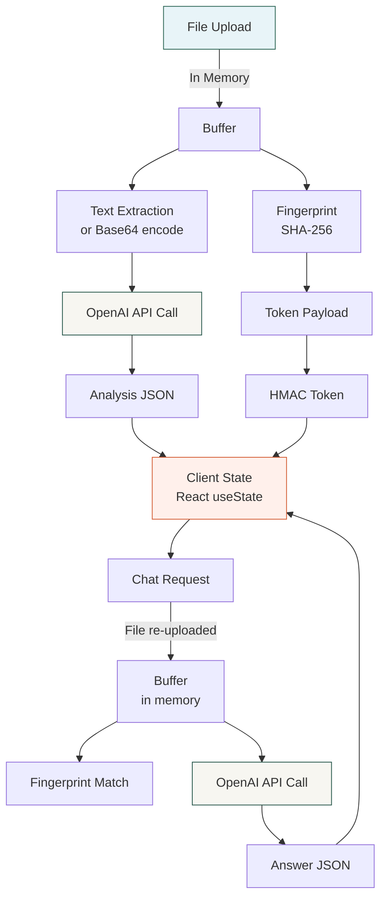
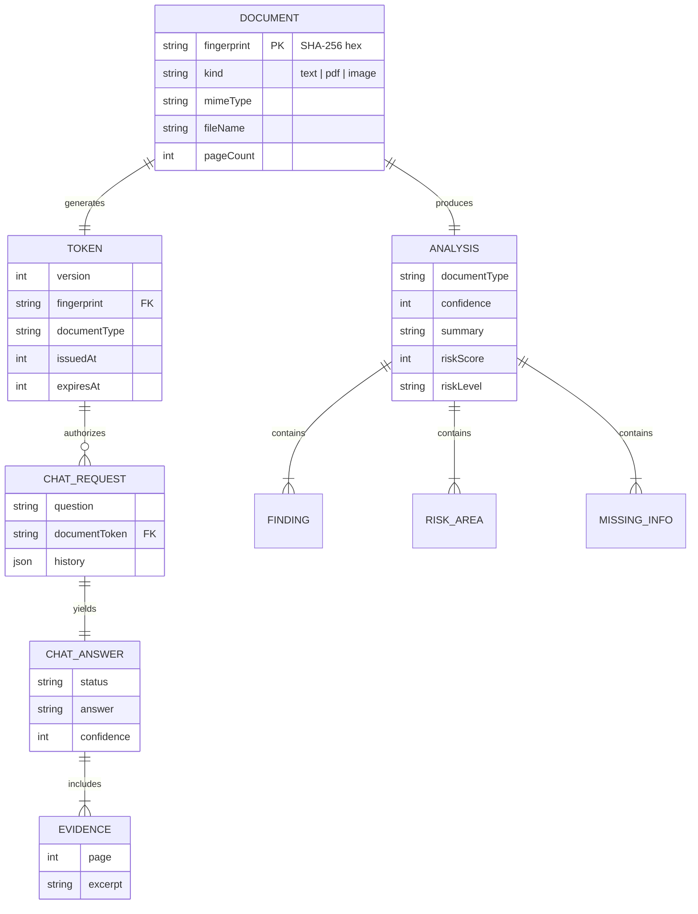

# Database & Data Structures

> Data schemas, validation rules, and data flow documentation for Clarity.

---

## Table of Contents

- [Overview](#overview)
- [Stateless Architecture](#stateless-architecture)
- [Data Schemas](#data-schemas)
- [Document Ingestion Types](#document-ingestion-types)
- [Analysis Response Schema](#analysis-response-schema)
- [Chat Request Schema](#chat-request-schema)
- [Chat Response Schemas](#chat-response-schemas)
- [Document Token Schema](#document-token-schema)
- [Eligibility Schema](#eligibility-schema)
- [Data Lifecycle](#data-lifecycle)
- [Entity Relationship Diagram](#entity-relationship-diagram)

---

## Overview

Clarity is a **stateless application** — it does not use any database, ORM, cache layer, or persistent storage. All data is processed in-memory within a single HTTP request/response cycle and exists only for the duration of that request.

---

## Stateless Architecture

| Aspect | Implementation |
|---|---|
| **Document Storage** | None — files are held in memory during processing only |
| **Analysis Results** | Returned to client; not persisted server-side |
| **Chat History** | Managed in client React state; sent back per-request |
| **Session State** | Encoded in self-contained HMAC tokens |
| **Rate Limit Counters** | In-process `Map` (ephemeral, resets on restart) |
| **User Accounts** | None |

---

## Data Schemas

All schemas are defined using **Zod** (`lib/schema.ts`, `lib/chat-guardrails.ts`, `lib/document-token.ts`, `lib/eligibility.ts`) and enforced at three levels:

1. **Client-side** — React component validation before upload
2. **Server-side** — Zod parsing of request data
3. **AI output** — OpenAI JSON Schema + Zod parsing of AI responses

---

## Document Ingestion Types

Defined in `lib/document-ingestion.ts`.

### IngestedDocument (Discriminated Union)

```typescript
// Text-based PDF (extractable text ≥ 40 characters)
type TextDocument = {
  kind: "text";
  mimeType: "application/pdf";
  fileName: string;          // Sanitized, max 150 chars
  fingerprint: string;       // SHA-256 hex digest (64 chars)
  text: string;              // Extracted and normalized text content
  pageCount: number;
};

// Image-based PDF (no extractable text)
type PdfDocument = {
  kind: "pdf";
  mimeType: "application/pdf";
  fileName: string;
  fingerprint: string;
  dataUrl: string;           // data:application/pdf;base64,...
  pageCount: number;
};

// Image file (JPEG, PNG, WebP)
type ImageDocument = {
  kind: "image";
  mimeType: "image/jpeg" | "image/png" | "image/webp";
  fileName: string;
  fingerprint: string;
  dataUrl: string;           // data:<mime>;base64,...
  width: number;
  height: number;
};

type IngestedDocument = TextDocument | PdfDocument | ImageDocument;
```

### Validation Constants

| Constant | Value | Description |
|---|---|---|
| `MAX_DOCUMENT_BYTES` | 15,728,640 (15 MB) | Maximum upload file size |
| `MAX_PDF_PAGES` | 100 | Maximum pages in a PDF |
| `MAX_IMAGE_PIXELS` | 25,000,000 | Maximum total pixel count |
| `MAX_IMAGE_DIMENSION` | 10,000 | Maximum pixels on any single side |
| `MIN_READABLE_TEXT_CHARS` | 40 | Minimum text to classify as text-based PDF |

---

## Analysis Response Schema

Defined in `lib/schema.ts` with OpenAI-compatible JSON Schema in `lib/openai-schema.ts`.

```typescript
type Analysis = {
  documentType: SupportedDocumentType;   // Enum of 12 types
  confidence: number;                     // 0–100
  summary: string | null;                // Plain-English summary
  documentPurpose: string | null;        // Purpose statement
  riskScore: number;                     // 0–100
  riskLevel: "Low" | "Medium" | "High";
  pros: Finding[];                       // Favorable terms
  cons: Finding[];                       // Unfavorable terms
  riskAreas: RiskArea[];                 // Risk areas with severity
  importantPoints: Finding[];            // Key points
  painPoints: Finding[];                 // Pain points
  missingInformation: MissingInfo[];     // Absent information
  questionsToAsk: (string | null)[];     // Suggested questions
  actionItems: (string | null)[];        // Recommended actions
};

// Extended response with session token
type AnalysisResponse = Analysis & {
  documentToken: string;
  documentTokenExpiresAt: string;        // ISO 8601
};

type Finding = {
  title: string | null;
  reason: string | null;
};

type RiskArea = {
  title: string | null;
  severity: "Low" | "Medium" | "High";
  reason: string | null;
  recommendation: string | null;
};

type MissingInfo = {
  field: string | null;
  whyImportant: string | null;
};
```

---

## Chat Request Schema

Defined in `lib/chat-guardrails.ts`.

### Chat History

```typescript
type ChatHistory = Array<{
  role: "user" | "assistant";
  content: string;               // min 1, max 800 chars, trimmed
}>;
// Maximum 6 messages in history
```

### Parsed Chat Request

```typescript
type ParsedChatRequest = {
  question: string;              // 2–500 chars, whitespace-normalized
  documentToken: string;         // 20–2048 chars
  history: ChatHistory;
};
```

---

## Chat Response Schemas

### Relevance Classification

```typescript
type ChatRelevance = {
  isDocumentRelated: boolean;
  category:
    | "clauses"
    | "definitions"
    | "rights"
    | "obligations"
    | "payments"
    | "termination"
    | "renewal"
    | "privacy"
    | "risks"
    | "missing_information"
    | "follow_up"
    | "unsupported";
  confidence: number;           // 0–100
  reasonCode:
    | "related"
    | "unrelated"
    | "prompt_injection"
    | "secret_request"
    | "outside_legal_advice"
    | "unclear";
};
```

### Chat Answer

```typescript
type ChatAnswer = {
  status: "answered" | "not_found";
  answer: string;               // min 1, max 1600 chars
  evidence: Evidence[];         // max 4 items
  confidence: number;           // 0–100
  followUpQuestions: string[];  // max 3, each max 160 chars
};

type Evidence = {
  page: number | null;          // Positive integer or null
  excerpt: string;              // min 1, max 240 chars
};
```

> **📝 Note:** When `status` is `"answered"`, at least one `evidence` item is required (enforced by `superRefine`).

---

## Document Token Schema

Defined in `lib/document-token.ts`.

### Token Payload

```typescript
type DocumentTokenPayload = {
  version: 1;                    // Fixed version number
  fingerprint: string;           // SHA-256 hex, /^[a-f0-9]{64}$/
  documentType: SupportedDocumentType;
  eligibilityConfidence: number; // 0–100
  issuedAt: number;              // Unix timestamp (seconds)
  expiresAt: number;             // issuedAt + 1800 (30 minutes)
};
```

### Token Format

```
<base64url-encoded-payload>.<base64url-HMAC-SHA256-signature>
```

### Token Configuration

| Parameter | Value |
|---|---|
| Algorithm | HMAC-SHA256 |
| TTL | 30 minutes (1800 seconds) |
| Clock Skew Tolerance | 60 seconds |
| Key Derivation | SHA-256 of `"clarity-document-token-v1\0" + secret` |
| Comparison | Timing-safe (`timingSafeEqual`) |

---

## Eligibility Schema

Defined in `lib/eligibility.ts`.

```typescript
type EligibilityResult = {
  isSupported: boolean;
  documentType: SupportedDocumentType | "Unsupported";
  confidence: number;           // 0–100
};
```

An eligible document requires all three:
- `isSupported === true`
- `documentType !== "Unsupported"`
- `confidence >= 70` (MIN_ELIGIBILITY_CONFIDENCE)

---

## Data Lifecycle



**Key Points:**
- Data exists in memory only during HTTP request processing
- The client is the only persistent store (React state)
- Files are re-uploaded for every chat request (no server storage)
- Tokens are self-contained and verified by signature, not by database lookup

---

## Entity Relationship Diagram

While there is no database, the logical data relationships are:



---

**Next:** [DEPLOYMENT.md](DEPLOYMENT.md) — Deployment guides for production environments.
