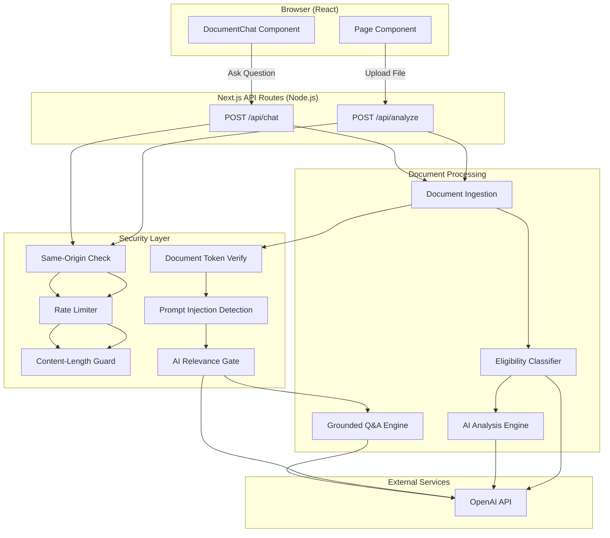

# Clarity — AI Document Analyzer

> **Evidence-based document intelligence, without legal advice.**

Clarity is an AI-powered document analysis platform built with **Next.js 14** and the **OpenAI API**. It enables users to upload legal and policy documents (PDF, JPG, PNG, WebP) and receive structured, evidence-based analysis including risk scoring, clause identification, obligation extraction, and interactive document Q&A — all in plain English.

---

## Table of Contents

- [Features](#features)
- [Screenshots](#screenshots)
- [Technology Stack](#technology-stack)
- [Architecture Overview](#architecture-overview)
- [Folder Structure](#folder-structure)
- [Installation](#installation)
- [Quick Start](#quick-start)
- [Environment Variables](#environment-variables)
- [Configuration](#configuration)
- [API Overview](#api-overview)
- [Database Overview](#database-overview)
- [Authentication & Authorization](#authentication--authorization)
- [Deployment](#deployment)
- [Available Scripts](#available-scripts)
- [Logging](#logging)
- [Error Handling](#error-handling)
- [Security Considerations](#security-considerations)
- [Performance Optimizations](#performance-optimizations)
- [Testing](#testing)
- [Troubleshooting](#troubleshooting)
- [Documentation Index](#documentation-index)
- [Known Limitations](#known-limitations)
- [Future Improvements](#future-improvements)
- [Support](#support)
- [License](#license)
- [Author](#author)

---

## Features

| Feature | Description |
|---|---|
| **Document Upload** | Drag-and-drop or click-to-browse. Supports PDF, JPG, PNG, and WebP up to 15 MB. |
| **AI-Powered Analysis** | Structured JSON analysis via OpenAI with risk scoring, clause identification, and obligation extraction. |
| **Document Eligibility Gate** | Rejects non-legal/non-policy documents before analysis using a dedicated classification step. |
| **Risk Engine** | Produces a 0–100 risk score with Low/Medium/High grading and per-risk recommendations. |
| **Grounded Document Q&A** | Interactive chat restricted to uploaded document content with evidence excerpts and confidence scores. |
| **Multi-Layer Guardrails** | Client-side validation, server-side request guards, prompt injection detection, and AI-level relevance filtering. |
| **Document Session Tokens** | HMAC-signed, time-limited tokens bind chat sessions to specific analyzed documents. |
| **Image & Scanned PDF Support** | Falls back to OpenAI vision for image-based PDFs lacking extractable text. |
| **Rate Limiting** | Per-IP, scope-aware rate limiting with sliding windows and `Retry-After` headers. |
| **Content Security Policy** | Production-hardened CSP, X-Frame-Options, Referrer-Policy, and Permissions-Policy headers. |
| **Responsive Design** | Fully responsive layout optimized for desktop and mobile viewports. |

---

## Screenshots

> _Screenshots should be placed in `docs/images/` and referenced below._

| View | Screenshot |
|---|---|
| Landing & Upload | `` |
| Analysis Report | `` |
| Document Chat | `` |

---

## Technology Stack

| Layer | Technology | Version |
|---|---|---|
| **Framework** | Next.js (App Router) | 14.2.35 |
| **Language** | TypeScript | 5.9.3 |
| **Runtime** | Node.js | ≥ 18 |
| **AI Provider** | OpenAI API (`openai` SDK) | ^4.77.0 |
| **PDF Parsing** | pdf-parse | 1.1.1 |
| **Schema Validation** | Zod | ^3.24.1 |
| **UI Library** | React | ^18.3.1 |
| **Styling** | Vanilla CSS (custom design system) | — |
| **Typography** | Google Fonts (DM Sans, DM Mono, Playfair Display) | — |

---

## Architecture Overview

Clarity follows a **serverless monolith** architecture using Next.js App Router. The frontend and API routes are deployed as a single unit. There is no external database — all state is ephemeral and scoped to individual request/response cycles.



For detailed architecture documentation, see [ARCHITECTURE.md](ARCHITECTURE.md).

---

## Folder Structure

```
contract_simplifier/
├── app/
│   ├── api/
│   │   ├── analyze/
│   │   │   └── route.ts          # Document analysis API endpoint
│   │   └── chat/
│   │       └── route.ts          # Document Q&A API endpoint
│   ├── chat.css                  # Chat component styles
│   ├── globals.css               # Global styles and design system
│   ├── icon.svg                  # Favicon
│   ├── layout.tsx                # Root layout with metadata
│   └── page.tsx                  # Main application page (upload + report)
├── components/
│   └── DocumentChat.tsx          # Interactive document Q&A component
├── lib/
│   ├── chat-guardrails.ts        # Chat relevance schemas, guardrail logic
│   ├── document-ingestion.ts     # File validation, PDF parsing, image processing
│   ├── document-token.ts         # HMAC token creation & verification
│   ├── document-types.ts         # Supported document type constants
│   ├── eligibility.ts            # Document eligibility classification
│   ├── openai-schema.ts          # OpenAI JSON Schema for structured output
│   ├── prompt.ts                 # System prompt for document analysis
│   ├── request-guard.ts          # Rate limiting, origin, content-length guards
│   └── schema.ts                 # Zod schemas for analysis response
├── types/
│   └── pdf-parse.d.ts            # TypeScript declarations for pdf-parse
├── docs/                         # Project documentation (this directory)
├── .env.example                  # Environment variable template
├── .gitignore                    # Git ignore rules
├── LICENSE                       # MIT License
├── next.config.mjs               # Next.js configuration with security headers
├── package.json                  # Node.js dependencies and scripts
└── tsconfig.json                 # TypeScript compiler configuration
```

---

## Installation

### Prerequisites

- **Node.js** ≥ 18.x
- **npm** ≥ 9.x (or equivalent package manager)
- **OpenAI API Key** with access to GPT-4o-mini (or desired model)

### Steps

```bash
# 1. Clone the repository
git clone <repository-url>
cd contract_simplifier

# 2. Install dependencies
npm install

# 3. Configure environment variables
cp .env.example .env
# Edit .env and add your OpenAI API key

# 4. Start the development server
npm run dev
```

The application will be available at `http://localhost:3000`.

For complete installation instructions, see [INSTALLATION.md](INSTALLATION.md).

---

## Quick Start

1. Open `http://localhost:3000` in your browser.
2. Drag and drop a PDF, JPG, PNG, or WebP document (max 15 MB).
3. Click **"Analyze document →"**.
4. Review the structured analysis: summary, risk score, key points, risk areas, and suggested actions.
5. Scroll to the **Document Q&A** section and ask questions about the uploaded document.

---

## Environment Variables

| Variable | Required | Default | Description |
|---|---|---|---|
| `OPENAI_API_KEY` | **Yes** | — | Your OpenAI API key. |
| `OPENAI_MODEL` | No | `gpt-4o-mini` | OpenAI model identifier for all AI operations. |
| `DOCUMENT_TOKEN_SECRET` | Recommended | Derived from `OPENAI_API_KEY` | Secret for HMAC signing of document session tokens. Must be ≥ 32 characters if set. |

> **⚠️ Warning:** If `DOCUMENT_TOKEN_SECRET` is not set, the server derives a signing key from `OPENAI_API_KEY` using domain separation (`clarity-document-token-v1`). For production deployments, always set a dedicated secret.

For comprehensive environment configuration, see [CONFIGURATION.md](CONFIGURATION.md).

---

## Configuration

All configuration is managed through environment variables and `next.config.mjs`. There is no database configuration, no ORM setup, and no additional config files required.

Key configuration areas:

- **Security Headers** — Defined in `next.config.mjs` (CSP, X-Frame-Options, Referrer-Policy, etc.)
- **Rate Limits** — Hardcoded in API routes: 10 requests/10 min (analyze), 30 requests/10 min (chat)
- **Document Limits** — 15 MB max file size, 100 max PDF pages, 25 MP max image pixels
- **Token TTL** — Document session tokens expire after 30 minutes

For full configuration details, see [CONFIGURATION.md](CONFIGURATION.md).

---

## API Overview

Clarity exposes two API endpoints via Next.js App Router API routes:

| Method | Endpoint | Description |
|---|---|---|
| `POST` | `/api/analyze` | Upload and analyze a document |
| `POST` | `/api/chat` | Ask a question about an analyzed document |

Both endpoints accept `multipart/form-data` and return JSON responses. For complete API documentation including request/response schemas, see [API.md](API.md).

---

## Database Overview

Clarity is a **stateless application**. It does not use any database, ORM, or persistent storage layer. All document processing occurs in-memory within a single request/response cycle:

- Uploaded files are read into memory as `Buffer` objects
- Analysis results are returned directly to the client
- Document session tokens are self-contained (HMAC-signed payloads)
- Rate limit counters are stored in-process memory and reset on server restart

For details on the data schemas and structures used, see [DATABASE.md](DATABASE.md).

---

## Authentication & Authorization

Clarity does not implement user authentication (login/registration). Access control is enforced through:

1. **Same-Origin Policy** — API routes reject cross-origin requests.
2. **Document Session Tokens** — HMAC-signed tokens bind chat requests to specific analyzed documents with a 30-minute TTL.
3. **Rate Limiting** — Per-IP rate limits prevent abuse.
4. **Document Fingerprinting** — SHA-256 fingerprints ensure the document in a chat request matches the originally analyzed document.

For full details, see [SECURITY.md](SECURITY.md).

---

## Deployment

Clarity is designed for deployment on **Vercel** (recommended) or any platform supporting Next.js:

```bash
# Production build
npm run build

# Start production server
npm start
```

Key deployment considerations:
- Set all environment variables in the hosting platform
- Ensure outbound HTTPS access to `api.openai.com`
- The `nodejs` runtime is required (not Edge)

For complete deployment instructions including Vercel, Docker, and self-hosted options, see [DEPLOYMENT.md](DEPLOYMENT.md).

---

## Available Scripts

| Script | Command | Description |
|---|---|---|
| `dev` | `npm run dev` | Start Next.js development server with hot reload |
| `build` | `npm run build` | Create optimized production build |
| `start` | `npm start` | Start production server (requires prior `build`) |
| `lint` | `npm run lint` | Run Next.js ESLint linter |

---

## Logging

Clarity uses `console.error` and `console.debug` for server-side logging:

| Level | Context | Behavior |
|---|---|---|
| `console.error` | API error handlers | Always active. Logs error types and Zod validation paths. |
| `console.debug` | Chat route (`[chat]` prefix) | Active only when `NODE_ENV !== "production"`. Logs raw AI responses for troubleshooting. |

There is no structured logging library, log aggregation, or external monitoring integration in the current codebase.

---

## Error Handling

Errors are handled through a layered custom error class hierarchy:

| Error Class | Module | HTTP Status |
|---|---|---|
| `RequestGuardError` | `request-guard.ts` | 400, 403, 413, 429 |
| `DocumentIngestionError` | `document-ingestion.ts` | 400, 413, 415, 422 |
| `DocumentTokenError` | `document-token.ts` | 401, 503 |
| `ChatRequestError` | `chat-guardrails.ts` | 400, 401 |
| `OpenAI.APIConnectionTimeoutError` | OpenAI SDK | 504 |
| `OpenAI.APIConnectionError` | OpenAI SDK | 503 |
| `z.ZodError` | Zod | 502 |

All errors return structured JSON: `{ "error": "Human-readable message" }`. Internal details are never exposed to clients.

---

## Security Considerations

| Control | Implementation |
|---|---|
| **Content Security Policy** | Strict CSP with `frame-ancestors 'none'`, `object-src 'none'`, production `upgrade-insecure-requests` |
| **X-Frame-Options** | `DENY` |
| **Referrer-Policy** | `no-referrer` |
| **Permissions-Policy** | Denies camera, microphone, geolocation, payment, USB |
| **Same-Origin Enforcement** | Server-side origin validation on all API routes |
| **Rate Limiting** | Per-IP, per-scope sliding window with `Retry-After` headers |
| **File Type Verification** | Magic-byte detection cross-checked against declared MIME type |
| **Image Dimension Limits** | Max 25 MP, max 10,000 px per side, container boundary validation |
| **Prompt Injection Detection** | Regex-based detection + AI-level relevance classification |
| **Document Tokens** | HMAC-SHA256, timing-safe comparison, 30-minute TTL, version-pinned |
| **No Source Maps** | `productionBrowserSourceMaps: false` |
| **No Powered-By Header** | `poweredByHeader: false` |

For the complete security analysis, see [SECURITY.md](SECURITY.md).

---

## Performance Optimizations

- **API caching disabled** — `Cache-Control: no-store, max-age=0` on all `/api/*` routes ensures fresh responses.
- **Streaming Architecture** — Client uses `AbortController` with 90-second timeouts.
- **Text Truncation** — Documents are capped at 120,000 characters; eligibility classification at 40,000 characters.
- **Incremental TypeScript** — `incremental: true` in `tsconfig.json` for faster rebuilds.
- **Optimized Bundling** — Next.js production build with tree-shaking and code splitting.
- **Minimal Dependencies** — Only 6 runtime dependencies.

---

## Testing

> **⚠️ Note:** The current repository does not contain a test suite, test configuration, or test files. No testing framework is installed.

«TODO: Unable to determine testing strategy from repository. Developer input required.»

For recommended testing approaches, see [TESTING.md](TESTING.md).

---

## Troubleshooting

For common issues and their solutions, see [TROUBLESHOOTING.md](TROUBLESHOOTING.md).

---

## Documentation Index

| Document | Description |
|---|---|
| [README.md](README.md) | This document — project overview and quick reference |
| [INSTALLATION.md](INSTALLATION.md) | Detailed installation and setup instructions |
| [ARCHITECTURE.md](ARCHITECTURE.md) | System architecture, component design, data flow |
| [API.md](API.md) | Complete API reference with schemas |
| [DATABASE.md](DATABASE.md) | Data structures and schema documentation |
| [DEPLOYMENT.md](DEPLOYMENT.md) | Deployment guides for Vercel, Docker, and self-hosted |
| [CONFIGURATION.md](CONFIGURATION.md) | Environment variables and runtime configuration |
| [SECURITY.md](SECURITY.md) | Security architecture and threat mitigations |
| [TESTING.md](TESTING.md) | Testing strategy and recommendations |
| [TROUBLESHOOTING.md](TROUBLESHOOTING.md) | Common issues and diagnostic procedures |
| [CONTRIBUTING.md](CONTRIBUTING.md) | Contribution guidelines and code standards |
| [CHANGELOG.md](CHANGELOG.md) | Version history and change log |
| [LICENSE.md](LICENSE.md) | License information |
| [FAQ.md](FAQ.md) | Frequently asked questions |

---

## Known Limitations

1. **No Persistent Storage** — Analysis results and chat history are lost on page refresh.
2. **No User Authentication** — No login, registration, or user management.
3. **In-Memory Rate Limiting** — Rate limit counters reset on server restart and are not shared across instances.
4. **Single-Model Dependency** — All AI operations depend on a single OpenAI model.
5. **No DOCX/TXT Support** — Despite PRD specifications, current implementation supports only PDF and image formats.
6. **No Report Export** — Analysis results cannot be exported or downloaded.
7. **No Multi-Language Support** — UI and analysis are English-only.
8. **30-Minute Session Limit** — Document chat sessions expire after 30 minutes.
9. **No OCR** — Scanned PDFs with no extractable text are sent as images to OpenAI Vision; there is no local OCR engine.
10. **120K Character Cap** — Documents exceeding 120,000 characters are truncated before analysis.

---

## Future Improvements

Based on the PRD and current implementation gaps:

- User authentication (Email, Google OAuth)
- Persistent document storage and history
- PDF/DOCX report export
- Document version comparison
- Multi-language support
- Clause bookmarking and annotation
- Dashboard with analytics
- Real-time collaboration
- External storage integration (Google Drive, Supabase)
- Structured logging and monitoring

---

## Support

For issues or questions:

1. Check the [Troubleshooting Guide](TROUBLESHOOTING.md)
2. Review the [FAQ](FAQ.md)
3. Open an issue in the repository

---

## License

This project is licensed under the **MIT License**. See the [LICENSE](../LICENSE) file for details.

Copyright © 2026 Binayak Bidyasagar

---

## Author

**Binayak Bidyasagar** & **Rakesh Sahoo**

Product: **Clarity — AI Document Analyzer** (v1.0.0)
