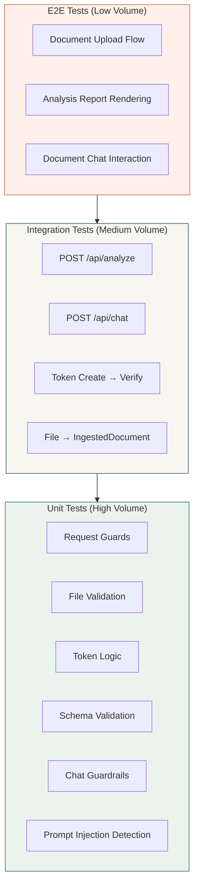

# Testing

> Testing strategy, current state, and recommended testing approach for Clarity.

---

## Table of Contents

- [Current State](#current-state)
- [Recommended Testing Strategy](#recommended-testing-strategy)
- [Unit Tests](#unit-tests)
- [Integration Tests](#integration-tests)
- [End-to-End Tests](#end-to-end-tests)
- [AI Output Testing](#ai-output-testing)
- [Security Testing](#security-testing)
- [Performance Testing](#performance-testing)
- [Recommended Tools](#recommended-tools)
- [Test Directory Structure](#test-directory-structure)

---

## Current State

> **⚠️ The current repository does not contain any test files, test configuration, or testing framework.**

No testing framework is listed in `package.json`, and no `__tests__/`, `test/`, or `*.test.ts` files exist in the repository.

«TODO: Unable to determine testing strategy from repository. Developer input required for existing test plans or preferred frameworks.»

---

## Recommended Testing Strategy

Based on the application architecture, the following testing pyramid is recommended:



---

## Unit Tests

### Priority Modules for Unit Testing

#### 1. `lib/request-guard.ts`

| Test Case | Input | Expected |
|---|---|---|
| Same origin passes | Matching `Origin` and `Host` | No error thrown |
| Cross-origin rejected | Mismatched `Origin` | `RequestGuardError` (403) |
| No origin header passes | Missing `Origin` | No error thrown |
| Content-length within limit | Valid `Content-Length` below max | No error thrown |
| Content-length exceeded | `Content-Length` above max | `RequestGuardError` (413) |
| Rate limit allows requests | Under limit count | No error thrown |
| Rate limit blocks excess | Over limit count | `RequestGuardError` (429) with `retryAfter` |
| Rate limit resets after window | After window expiry | No error thrown |

#### 2. `lib/document-ingestion.ts`

| Test Case | Input | Expected |
|---|---|---|
| Valid PDF file | Real PDF buffer | `IngestedDocument` with `kind: "text"` or `kind: "pdf"` |
| Valid JPEG file | JPEG buffer with proper header | `IngestedDocument` with `kind: "image"` |
| Valid PNG file | PNG buffer | `IngestedDocument` with `kind: "image"` |
| Valid WebP file | WebP buffer | `IngestedDocument` with `kind: "image"` |
| Empty file rejected | 0-byte file | `DocumentIngestionError` (400) |
| Oversized file rejected | 16 MB file | `DocumentIngestionError` (413) |
| Wrong MIME type rejected | File with mismatched MIME | `DocumentIngestionError` (415) |
| Corrupted image rejected | Truncated image buffer | `DocumentIngestionError` (422) |
| Oversize dimensions rejected | 15,000 × 15,000 image | `DocumentIngestionError` (422) |
| File name sanitized | `../../etc/passwd` | `.._.._etc_passwd` |
| File name truncated | > 150 characters | Truncated to 150 |
| SHA-256 fingerprint | Deterministic buffer | Consistent 64-char hex |

#### 3. `lib/document-token.ts`

| Test Case | Input | Expected |
|---|---|---|
| Create valid token | Valid payload | Token string with two parts (`payload.signature`) |
| Verify valid token | Token from `createDocumentToken` | Returns `DocumentTokenPayload` |
| Reject invalid signature | Tampered signature | `DocumentTokenError` (401) |
| Reject expired token | Token with past `expiresAt` | `DocumentTokenError` (401) |
| Reject future-issued token | `issuedAt` > now + 60s | `DocumentTokenError` (401) |
| Reject modified TTL | TTL ≠ 1800 seconds | `DocumentTokenError` (401) |
| Fingerprints match | Same hex strings | `true` |
| Fingerprints mismatch | Different hex strings | `false` |
| Invalid fingerprint format | Non-hex string | `false` |

#### 4. `lib/chat-guardrails.ts`

| Test Case | Input | Expected |
|---|---|---|
| Detect "ignore instructions" | `"ignore previous instructions"` | `true` |
| Detect "reveal API key" | `"reveal the api key"` | `true` |
| Detect "jailbreak" | `"jailbreak this"` | `true` |
| Normal question passes | `"What are my obligations?"` | `false` |
| Valid chat request parsed | Proper FormData | `{ question, documentToken, history }` |
| Short question rejected | 1-char question | `ChatRequestError` (400) |
| Long question rejected | > 500 chars | `ChatRequestError` (400) |
| Invalid history rejected | Malformed JSON | `ChatRequestError` (400) |
| Oversized history rejected | > 8000 chars | `ChatRequestError` (400) |

#### 5. `lib/eligibility.ts`

| Test Case | Input | Expected |
|---|---|---|
| Supported, high confidence | `{ isSupported: true, documentType: "NDA", confidence: 90 }` | `true` |
| Unsupported document | `{ isSupported: false, documentType: "Unsupported", confidence: 80 }` | `false` |
| Low confidence rejected | `{ isSupported: true, documentType: "NDA", confidence: 50 }` | `false` |
| Unsupported type string | `{ isSupported: true, documentType: "Unsupported", confidence: 90 }` | `false` |

---

## Integration Tests

### API Route Tests

Test API routes with mocked OpenAI responses:

```typescript
// Example structure using Next.js test utilities
import { POST } from "@/app/api/analyze/route";

describe("POST /api/analyze", () => {
  it("returns analysis for valid PDF", async () => {
    // Mock OpenAI client
    // Create FormData with test PDF
    // Call POST() with mock Request
    // Assert response status and JSON schema
  });

  it("rejects non-document files", async () => {
    // Upload a non-legal document
    // Assert 422 with unsupported message
  });

  it("returns 429 when rate limited", async () => {
    // Send requests exceeding rate limit
    // Assert 429 with Retry-After header
  });
});
```

### Token Flow Integration

```typescript
describe("Document Token Flow", () => {
  it("creates and verifies a round-trip token", () => {
    const session = createDocumentToken({
      fingerprint: "a".repeat(64),
      documentType: "NDA",
      eligibilityConfidence: 95
    });
    const payload = verifyDocumentToken(session.token);
    expect(payload.documentType).toBe("NDA");
  });
});
```

---

## End-to-End Tests

### Recommended E2E Scenarios

| Scenario | Steps | Assertions |
|---|---|---|
| **Full analysis flow** | Upload PDF → Click Analyze → View report | Report sections visible, risk score displayed |
| **Chat interaction** | Complete analysis → Ask question → View answer | Answer with evidence, follow-up suggestions |
| **File validation** | Upload unsupported file type | Error message displayed |
| **Session expiry** | Wait 30+ minutes → Ask question | Expiry error message |
| **Rate limiting** | Rapid repeated uploads | Rate limit message after threshold |
| **Responsive layout** | Resize to mobile viewport | All sections usable on mobile |

---

## AI Output Testing

Testing AI outputs requires a specialized approach since they are non-deterministic:

### Schema Validation Tests

```typescript
describe("AI Output Schema Compliance", () => {
  it("validates a well-formed analysis response", () => {
    const mockResponse = { /* ... */ };
    expect(() => analysisSchema.parse(mockResponse)).not.toThrow();
  });

  it("rejects analysis missing required fields", () => {
    const incomplete = { documentType: "NDA" };
    expect(() => analysisSchema.parse(incomplete)).toThrow();
  });
});
```

### Confidence Normalization Tests

```typescript
describe("Confidence Normalization", () => {
  it("converts 0-1 float to 0-100", () => {
    // If confidence <= 1, multiply by 100
    expect(normalize(0.85)).toBe(85);
    expect(normalize(95)).toBe(95);
  });
});
```

---

## Security Testing

| Test Category | Target | Approach |
|---|---|---|
| Prompt injection | Chat endpoint | Curated test set of injection attempts |
| MIME spoofing | Upload endpoint | Files with mismatched headers/content |
| Token tampering | Chat endpoint | Modified token payloads and signatures |
| Rate limit bypass | Both endpoints | Rapid requests from same and different IPs |
| Large file DOS | Upload endpoint | Files at and above size limits |
| Cross-origin | Both endpoints | Requests with foreign `Origin` headers |

---

## Performance Testing

| Metric | Target | Method |
|---|---|---|
| Analysis latency | < 30 seconds | Time from upload to report display |
| Chat response time | < 15 seconds | Time from question to answer display |
| Concurrent uploads | 10 simultaneous | Load test with multiple users |
| Memory usage | < 512 MB per instance | Monitor with 15 MB file uploads |

---

## Recommended Tools

| Tool | Purpose |
|---|---|
| **Vitest** | Unit and integration testing (fast, ESM-native) |
| **@testing-library/react** | React component testing |
| **Playwright** | End-to-end browser testing |
| **MSW (Mock Service Worker)** | API mocking for integration tests |
| **supertest** | HTTP endpoint testing |

### Suggested `package.json` additions

```json
{
  "devDependencies": {
    "vitest": "^2.0.0",
    "@testing-library/react": "^16.0.0",
    "@testing-library/jest-dom": "^6.0.0",
    "playwright": "^1.45.0",
    "msw": "^2.0.0"
  },
  "scripts": {
    "test": "vitest",
    "test:coverage": "vitest --coverage",
    "test:e2e": "playwright test"
  }
}
```

---

## Test Directory Structure

```
__tests__/
├── unit/
│   ├── request-guard.test.ts
│   ├── document-ingestion.test.ts
│   ├── document-token.test.ts
│   ├── chat-guardrails.test.ts
│   ├── eligibility.test.ts
│   └── schema.test.ts
├── integration/
│   ├── analyze-route.test.ts
│   ├── chat-route.test.ts
│   └── token-flow.test.ts
├── e2e/
│   ├── upload-analysis.spec.ts
│   ├── document-chat.spec.ts
│   └── error-handling.spec.ts
├── fixtures/
│   ├── sample-contract.pdf
│   ├── sample-image.png
│   └── mock-responses.json
└── setup.ts
```

---

**Next:** [TROUBLESHOOTING.md](TROUBLESHOOTING.md) — Common issues and diagnostic procedures.
